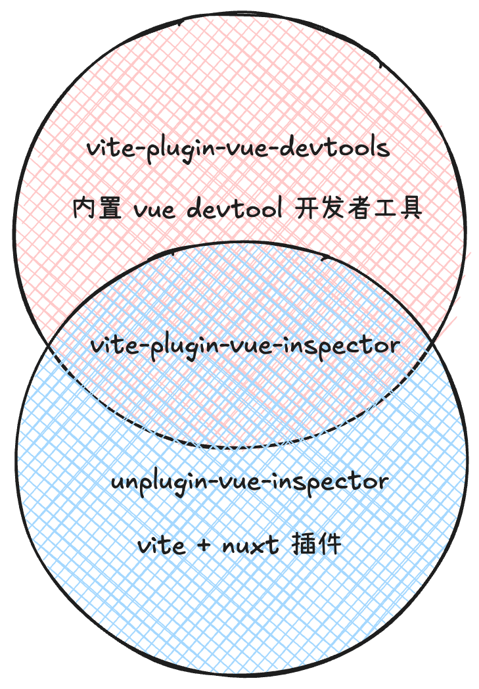

# 点击浏览器的元素时自动跳转到本地 IDE

## 选型

为了加快开发者快速从浏览器中，跳转到本地 `IDE` 中查看元素。在尝试了几种方案之后，最终选用了这个方案:

- `vite` 项目使用 [vite-plugin-vue-inspector](https://www.npmjs.com/package/vite-plugin-vue-inspector) 
- `webpack(vue-cli)` 项目使用 [code-inspector-plugin](https://www.npmjs.com/package/code-inspector-plugin)

### 为什么选用 `vite-plugin-vue-inspector`?

#### 优势

1. `vue` 官方团队维护的项目，已经被写在了 [devtools.vuejs.org](https://devtools.vuejs.org/) 文档上，不用担心烂尾。
2. 和 `vue` 高度集成，注入效果更好，支持 `vue2` / `vue3` / `SSR`，符合我们多 `vue` 版本项目的现状。
3. 支持多种 `IDE` 集成，跳转到指定代码行的能力，符合我们目前 `vscode` / `webstorm` 混用的现状
4. 下载量一个月 `285` 万次，经过了充分的实践测试

#### 劣势

但是它只支持 `vite`, 即使是它的超集 [unplugin-vue-inspector](https://www.npmjs.com/package/unplugin-vue-inspector)，在阅读过源代码之后，发现也只支持  `vite` 和 `nuxt`。

### 为什么选用 `code-inspector-plugin`

#### 优势

1. 能够支持 `webpack` 以及 `vue2` / `vue3` 项目，符合项目现状
2. 也能支持多种 `IDE` 集成，跳转到指定代码行的能力

#### 劣势

1. 非官方团队维护，怕烂尾。
2. 注入效果不如官方团队的 `vite-plugin-vue-inspector`，为了跨框架的通用性，需要显式在每个 `dom` 上注入一个属性 `data-insp-path` 属性
3. 下载量一个月 `12` 万次，只有 `vite-plugin-vue-inspector` 的 `1/20`

## Vite 项目注册插件

### 安装插件

```sh
yarn add -D vite-plugin-vue-inspector
# or
pnpm i -D vite-plugin-vue-inspector
```

### Vite + Vue3 项目

```ts
import { defineConfig } from 'vite'
import Vue from '@vitejs/plugin-vue'

import Inspector from 'vite-plugin-vue-inspector'

export default defineConfig({
  plugins: [Vue(), Inspector()],
})
```

### Vite + Vue2 项目

```ts
import { defineConfig, } from 'vite'
import Vue from '@vitejs/plugin-vue2'
import Inspector from 'vite-plugin-vue-inspector'

export default defineConfig({
  plugins: [
    Vue(),
    Inspector({
      vue: 2
    }),
  ],
})
```

### 使用功能

在打开页面的时候，页面中间会出现一个 `vue` 的小按钮，点击选择元素即可跳转至 `IDE`

或者使用快捷键 `control` + `shift` 然后选择元素

## Webpack (vue cli 项目) 注册插件

### 安装插件

```sh
yarn add -D code-inspector-plugin

pnpm i -D code-inspector-plugin
```

### 注册插件

在你的 `vue.config.js` 文件中添加如下代码：

```js
const { defineConfig } = require('@vue/cli-service')
const { codeInspectorPlugin } = require('code-inspector-plugin');

module.exports = defineConfig({
  transpileDependencies: true,
  chainWebpack: (config) => {
    config.plugin('code-inspector-plugin').use(
      codeInspectorPlugin({
        bundler: 'webpack',
      })
    );
  },
})
```

然后运行 `serve` 即可看到效果。另外一点值得注意的是，构建的时候，默认是不会进行任何的注入的，所以此插件可以直接注册，不需要环境变量进行控制。

### 使用功能

打开浏览器控制台, 此时在你的 `console` 会显示一个信息:

```
[code-inspector-plugin]同时按住 `shift` + `alt` 时启用功能(点击页面元素可定位至编辑器源代码)
```

然后你使用对于按键，点击页面元素，即可跳转到 `IDE` 对应的代码行。

## 不同 IDE 跳转到源代码

这个可以通过插件的配置项 `launchEditor` 设置，详见 [vite-plugin-vue-inspector文档](https://github.com/webfansplz/vite-plugin-vue-inspector) 和 [code-inspector-plugin文档](https://inspector.fe-dev.cn/guide/ide.html)

比较好的方式是，利用环境变量，动态的控制，比如有些人用 `vscode` 那么就不需要任何设置，因为插件默认就是 `vscode`，假如你使用 `webstorm`

那么，你可以通过配置你的本地环境变量，来把插件跳转指向 `webstorm`, 具体的方式见文档或者来找我。

## 故障排查

### 打开 Vscode 编辑器报错

```txt
Could not open index.vue in the editor.
The editor process exited with an error: spawn code ENOENT ('code' command does not exist in 'PATH').
```

这是因为你没有在系统中注册 `code` 命令，可以通过 `ctrl` + `shift` + `p` 打开 `vscode` 的命令面板，然后输入 `shell command`，选择 `Shell Command: Install 'code' command in PATH`，然后重启 `vscode` 即可。

## 扩展阅读

### vite-plugin-vue-devtools

这个包是 `vite`/`vue` 团队官方维护的开发者工具包，它内部也包含了 [vite-plugin-vue-inspector](https://www.npmjs.com/package/vite-plugin-vue-inspector) 的所有功能，同时也把整个浏览器 `vue devtools` 插件，也集成到这个 `vite` 插件中了。

但是这个包，只支持 `vue3` + `vite` 项目，原因在于它里面 `vue devtools` 相关的代码只支持 `vue3`，所以假如你要使用它，请在 `vue3` + `vite` 项目中使用, 同时你就可以把 [vite-plugin-vue-inspector](https://www.npmjs.com/package/vite-plugin-vue-inspector) 或 [unplugin-vue-inspector](https://www.npmjs.com/package/unplugin-vue-inspector) 干掉了。

### 包含关系



## 参考资料

- [vite-plugin-vue-inspector](https://www.npmjs.com/package/vite-plugin-vue-inspector)
- [code-inspector-plugin](https://inspector.fe-dev.cn/)